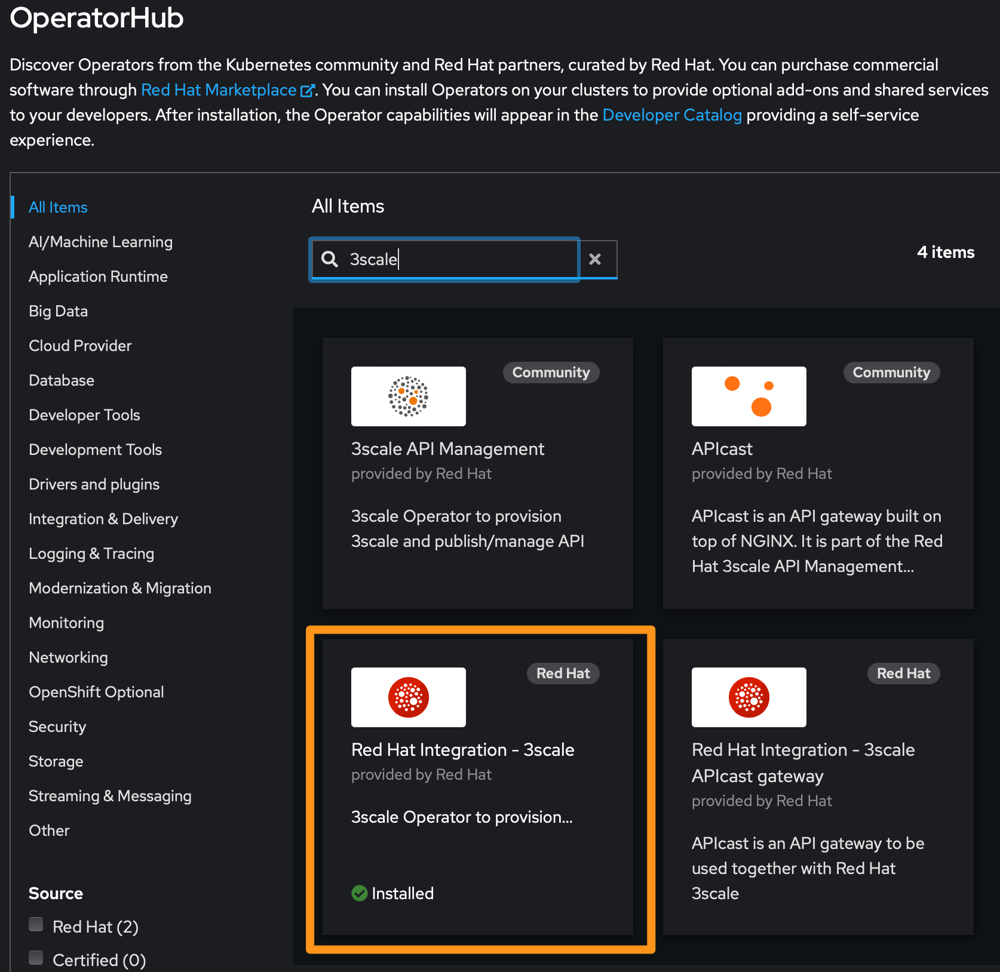
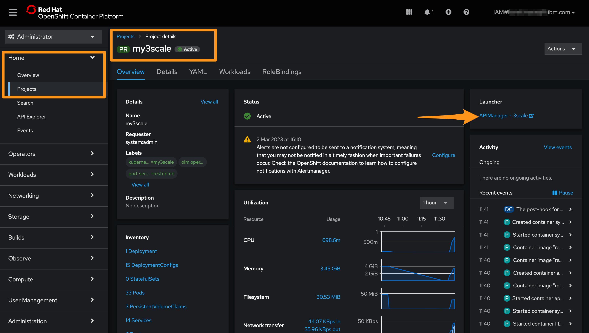

# Install 3scale operator on OpenShift on IBM Cloud

## Prerequisites

* An IBM Cloud Account with Admin access rights
* An OpenShift cluster on IBM Cloud, a.k.a ROKS
* A COS bucket

## Create the environment

Terraform can be used to provision the Cloud Services: the OpenShift cluster, the COS bucket.

1. Initialize the terraform

    ```sh
    terraform init
    ```

1. Generate a plan

    ```sh
    terraform plan -var-file="testing.auto.tfvars"
    ```

1. Apply the Terraform plan

    ```sh
    terraform apply -var-file="testing.auto.tfvars"
    ```

> You can also provision the Cloud Services via IBM Cloud Schematics.

## Connect to the OpenShift Cluster

1. Target the correct Resource Group

    ```sh
    ibmcloud target -g <your-resource-group-name>
    ```

    > If you have used Terraform, the default Resource Group is `my3scale-group`.

    ```sh
    ibmcloud target -g my3scale-group
    ```

1. Set the cluster name variable by replacing the cluster-name (including <>).

    ```sh
    export CLUSTER_NAME=<your-cluster-name>
    ```

    > If you have used Terraform, the default cluster name is `my3scale-roks`.

    ```sh
    export CLUSTER_NAME=my3scale-roks
    ```

1. Connect to the OpenShift cluster via the CLI

    ```sh
    ibmcloud ks cluster config --cluster $CLUSTER_NAME --admin
    ```

1. Set the project name.

    ```sh
    export THREESCALE_PROJECT=my3scale
    ```

1. Create a new Project

    ```sh
    oc new-project $THREESCALE_PROJECT
    ```

## Configure the RH Registry Service Account

1. Create a Registry Service Account https://access.redhat.com/terms-based-registry/#/accounts

1. Set the value of the token.

    ```sh
    export TOKEN_USERNAME="<your-token-username>"
    export TOKEN_PASSWORD="<your-token-password>""
    ```

1. Submit the secret to the cluster using this command:

    ```sh
    oc create secret docker-registry threescale-registry-auth \
    --docker-server=registry.redhat.io \
    --docker-username=$TOKEN_USERNAME \
    --docker-password=$TOKEN_PASSWORD
    ```

1. Link the secret to your project

    ```sh
    oc secrets link default threescale-registry-auth --for=pull
    oc secrets link builder threescale-registry-auth
    ```

    > --docker-email="lionel.mace@fr.ibm.com"

## Configure access to IBM Cloud COS

1. Select the storage instance from the [COS list](https://cloud.ibm.com/objectstorage)

    > The instance created by terraform is named `my3scale-cos`.

1. Create a file cos-credentials.env from a template

    ```sh
    cp cos-credentials.env.template cos-credentials.env
    ```

1. Edit the credentials with your COS HMAC key, bucket and endpoint information

    ```txt
    AWS_ACCESS_KEY_ID=<replace_with_cos_hmac_keys_access_key_id>
    AWS_SECRET_ACCESS_KEY=<replace_with_cos_hmac_keys_secret_access_key>
    AWS_BUCKET=cos-bucket-for-3scale
    AWS_HOSTNAME=s3.eu-de.cloud-object-storage.appdomain.cloud
    AWS_REGION=eu-de
    ```

1. Create the secret in the project

    ```sh
    oc create secret generic ibmcloud-cos-credentials --namespace=$THREESCALE_PROJECT --from-env-file=cos-credentials.env
    ```

## Install the 3scale operator

We will install this operator using the command line



1. Find the 3scale operator you want to install from OperatorHub

    ```sh
    oc get packagemanifests | grep 3scale
    ```

1. Inspect your desired Operator to verify its supported install modes and available channels.

    ```sh
    oc describe packagemanifests 3scale -n openshift-marketplace
    ```

1. Verify that the cluster service version (CSV)

    ```sh
    oc describe packagemanifests 3scale -n openshift-marketplace | grep CSV
    ```

1. Install the 3scale operator

    ```sh
    oc apply -f - <<EOF
    ---
    apiVersion: operators.coreos.com/v1alpha1
    kind: Subscription
    metadata:
      name: 3scale-operator
      namespace: $THREESCALE_PROJECT
    spec:
      channel: threescale-2.13
      installPlanApproval: Automatic 
      name: 3scale-operator
      source: redhat-operators
      sourceNamespace: openshift-marketplace
      startingCSV: 3scale-operator.v0.10.1-0.1675914645.p
    EOF
    ```

## Create the 3scale APIManager

APIManager requires a wildcard DNS domain. We will use the ingress domain automatically created at the cluster provisioning time.

1. Retrieve and store the value of the cluster ingress domain.

    ```sh
    export INGRESS_DOMAIN=$(ibmcloud ks cluster get -c $CLUSTER_NAME | grep "Ingress Subdomain" | awk '{print tolower($3)}')
    ```

1. Verify the value of the ingress domain.

    ```sh
    echo $INGRESS_DOMAIN
    ```

    It should look like this:

    ```sh
    my3scale-roks-483cccd2f0d38128dd40d2b711142ba9-0000.eu-de.containers.appdomain.cloud
    ```

1. Create the APIManager

    ```sh
    oc apply -f - <<EOF
    ---
    apiVersion: apps.3scale.net/v1alpha1
    kind: APIManager
    metadata:
      name: example-apimanager
      namespace: $THREESCALE_PROJECT
    spec:
      wildcardDomain: $INGRESS_DOMAIN
      system:
        fileStorage:
          simpleStorageService:
            configurationSecretRef:
              name: ibmcloud-cos-credentials
    EOF
    ```

> It takes about 5 minutes for the all the pods of the APIManaged to install.

## Launch the 3scale Master Admin Console

Once the installation is complete, you will be able to access the 3scale console.

1. Go to your `my3scale` project, you should see a 3scale Launcher hyperlink

    

1. Retrieve the MASTER_USER and MASTER_PASSWORD from the Secret `system-seed`.

    

1. Login to 3scale

    

## Resources

* [3scale complete installation guide](https://access.redhat.com/documentation/en-us/red_hat_3scale_api_management/2.13/html/installing_3scale/index)
